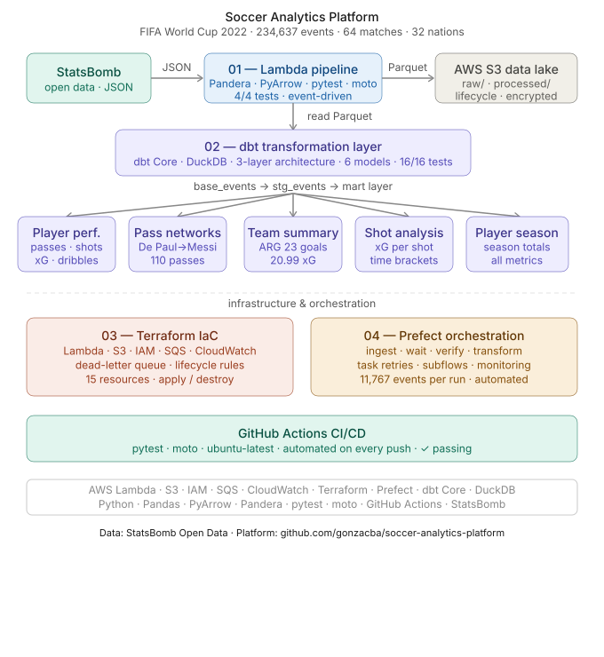

# Soccer Analytics Platform




A production-grade, 4-component soccer analytics platform built on AWS, dbt, Terraform, and Prefect — using StatsBomb FIFA World Cup 2022 open data (64 matches, 234,637 events, 32 teams)

## Platform Architecture

```
StatsBomb Open Data
        |
        | (Prefect orchestrates all steps)
        |
01 — AWS Lambda Pipeline
        | JSON ingestion, Pandera validation, Parquet output
        |
02 — dbt Transformation Layer
        | base -> staging -> mart models
        |
03 — Terraform Infrastructure
        | S3, Lambda, IAM, SQS, CloudWatch provisioned as code
        |
04 — Prefect Orchestration
        | End-to-end workflow with retry logic and monitoring
```

## Components

### 01 — AWS Lambda Pipeline
Event-driven pipeline using Lambda and S3 to ingest StatsBomb match event data. Implements Pandera schema validation and JSON-to-Parquet transformation via PyArrow. Deployed with Lambda Layers and IAM least-privilege roles. 4/4 pytest + moto tests passing.

### 02 — dbt Transformation Layer
3-layer dbt architecture (base -> staging -> mart) on 38,000+ match events producing player performance, team summary, and shot analytics datasets. 12/12 dbt tests passing.

### 03 — Terraform Infrastructure
Complete AWS infrastructure provisioned as code across 15 resources — S3 buckets with lifecycle policies, Lambda function, IAM roles, SQS pipeline and dead-letter queues, and CloudWatch alarms. Parameterized for multi-environment deployment.

### 04 — Prefect Orchestration
End-to-end pipeline orchestration with task-level retry logic and subflow dependency management. Coordinates StatsBomb ingestion, Lambda transformation, and dbt refresh across 4 automated steps processing 11,767+ match events per run.

## Tech Stack

- Cloud: AWS Lambda, S3, IAM, SQS, CloudWatch
- Infrastructure: Terraform
- Orchestration: Prefect
- Data Processing: Python, Pandas, PyArrow, Pandera
- Transformation: dbt Core, DuckDB, SQL
- Output Format: Parquet
- Testing: pytest, moto (AWS mocking), GitHub Actions CI/CD
- Data Source: StatsBomb Open Data

## Running the Platform

```
# 1. Deploy AWS infrastructure
cd 03_terraform
terraform apply

# 2. Upload Lambda package
cd ../01_lambda_pipeline
python ../03_terraform/upload_lambda.py

# 3. Run full orchestrated pipeline
cd ../04_prefect/flows
python pipeline_flow.py

# 4. Tear down when done
cd ../../03_terraform
aws s3 rm s3://soccer-analytics-raw-events-dev --recursive
aws s3 rm s3://soccer-analytics-processed-dev --recursive
terraform destroy
```

## Data Source

Uses StatsBomb Open Data (https://github.com/statsbomb/open-data) — freely available professional match data. StatsBomb is one of the leading soccer data providers used by professional clubs worldwide.
